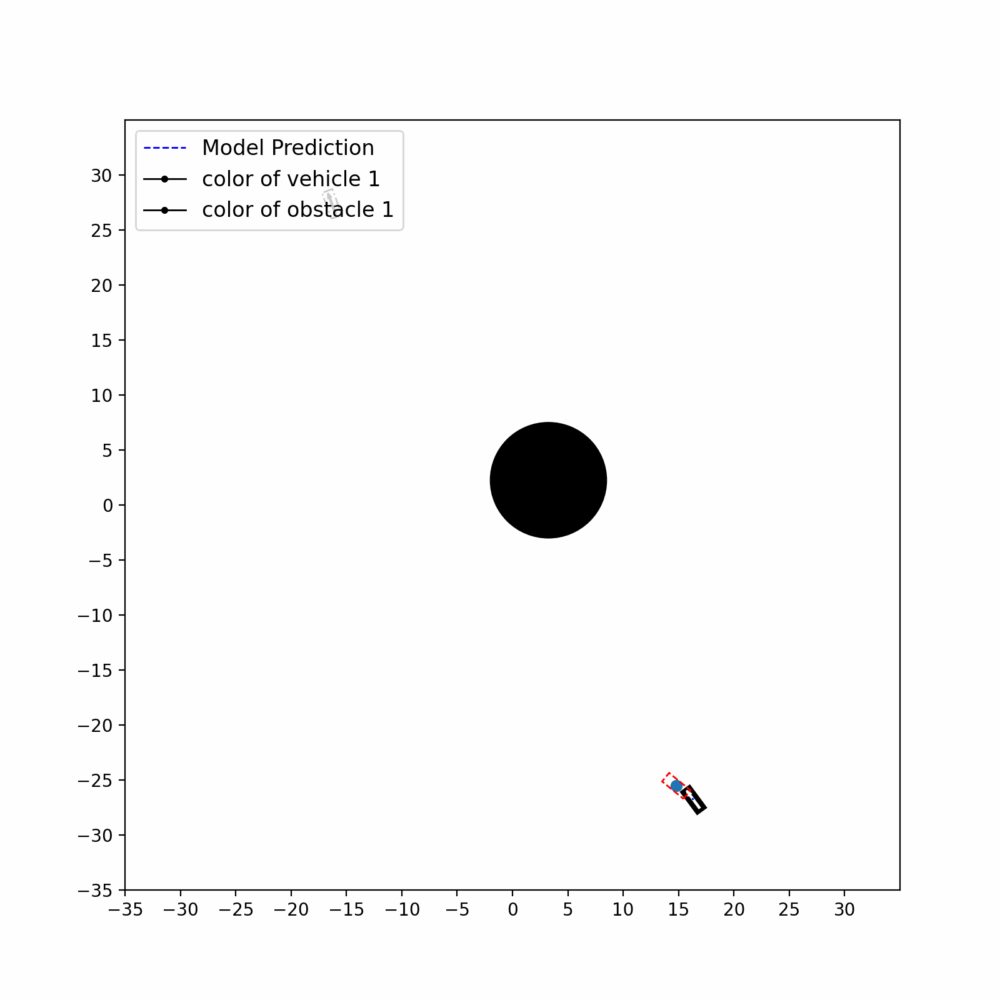
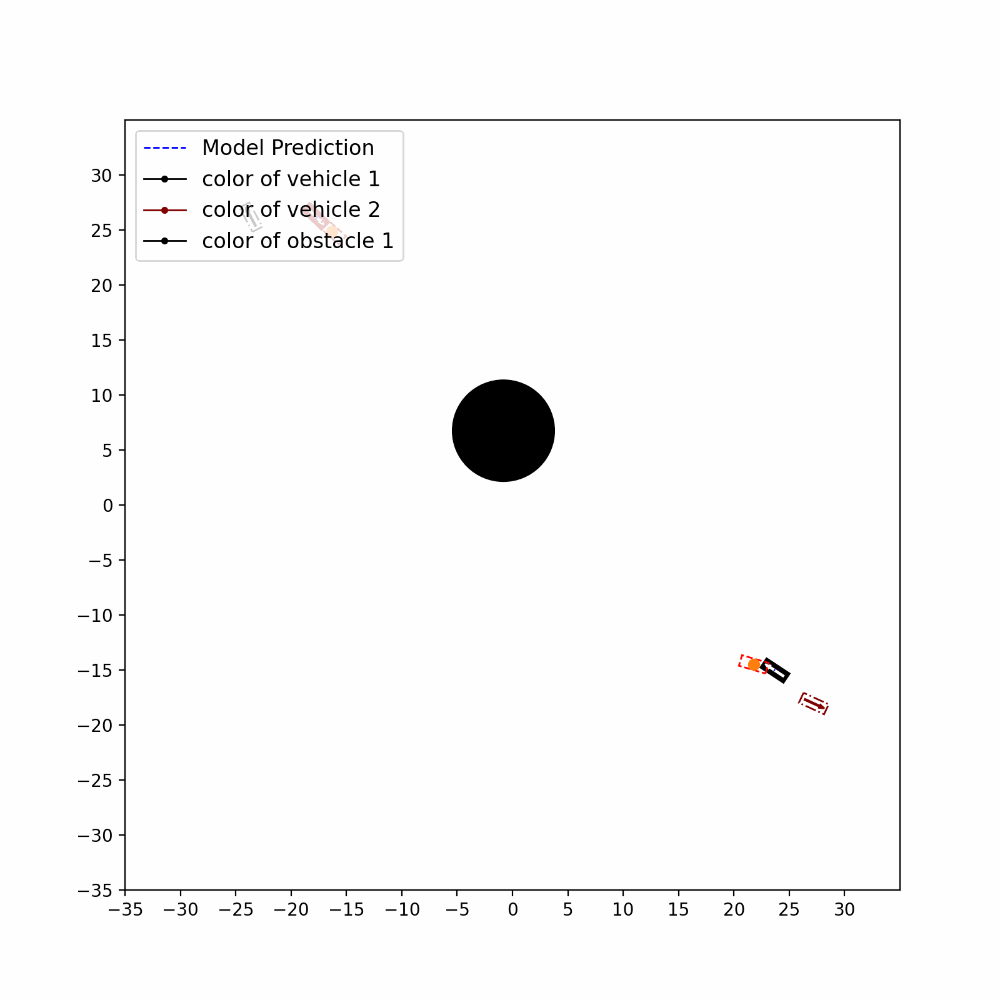

# Self-Supervised Multi-Agent Navigation in Unconstrained Environments

This project aims to train a model capable of guiding a vehicle from a starting position to a target position while avoiding collisions. It is based on the paper [Multi-Agent Navigation in Unconstrained Environments](https://arxiv.org/abs/2307.16727). In this paper, a model is trained to guide vehicles in a similar manner. However, it is done in a supervised way with labels obtained from an optimization algorithm. These labels are used to train a model. This project aims to eliminate the separate step of obtaining labels and attempts to directly train the model in a self-supervised manner by designing a loss function.

## Dynamic Vehicle Equation

The dynamic vehicle control model simulates the vehicles based on control inputs. Position, angle, and velocity of the vehicle depend on the previous state. The learned model should predict the correct steering and pedal inputs to guide vehicles to their target position. The challenge here is the fact that such a vehicle model is a non-holonomic system, meaning that the position can only indirectly be influenced.

%20\cdot%20\Delta%20t)

%20\cdot%20\Delta%20t)

%20\cdot%20\gamma%20\cdot%20\Delta%20t)

# Training a Model

Initially, a method similar to the one described in the aforementioned paper was applied to the self-supervised approach. However, in the absence of labels, the model's training performance fell short compared to when labels were present. The fewer constraints that were imposed on the simulation settings—such as variations in starting points, targets, and obstacle placements—the poorer the training outcome. In a fully unconstrained setting, the self-supervised model couldn't reduce the training loss whatsoever. As a solution, the concept of dividing the model into two distinct sub-models was introduced. One sub-model strives to predict the subsequent target based on the global target, while the other focuses on navigating the vehicle from its present location to that next target. The former is referred to as the "trajectory model," and the latter as the "vehicle model." The trajectory model seeks to predict the next target in a manner that averts collisions, whereas the vehicle model solely concentrates on forecasting the appropriate vehicular input to reach the subsequent target. Splitting these functions into two separate models significantly enhanced the ability to learn of both models.

## Vehicle Model

The vehicle model takes an intermediate target as input and predicts the steering and pedal input which will subsequently be the input for the dynamic vehicle equation computing the next state. The vehicle model is an MLP that is applied to each vehicle separately. Each vehicle is encoded by 4 values describing its state (x,y,angle,velocity) and 4 values describing its target state (x,y,angle,velocity). The vehicle model predicts for each horizon step the steering and pedal input

### Loss

The vehicle model is trained in an unsupervised manner. The loss is based on the difference of the position, angle, and velocity of the current state and the target state. The loss is used to train the vehicle model guiding the vehicles from their current position to their current target. The current target is obtained by the trajectory model.

## Trajectory Model

The trajectory model takes the set of vehicles and obstacles as input and predicts the next intermediate target for each vehicle, i.e. just one point for each predicted time horizon. The model can either be an MLP with a fixed number of vehicles and obstacles or a GNN with an arbitrary number of them. The GNN connects all vehicles and obstacles in one simulation and uses the [Transformer Conv](https://arxiv.org/abs/2009.03509) edge update to model their relations. The plots show the attention that each vehicle spends towards the obstacles.

### Loss

The trajectory model is trained in an unsupervised manner. The loss is split into two sub-losses. The position loss penelizes the predicted position's distance from the gloabl target and makes sure the vehilces are guided towards their targets. The collision loss penelizes positions of vehicles that are too close to obstacles or other vehicles and helps to avoid collisions.

}_{t}%20-%20X^{(i)}_{\text{target}}%20\Vert^2%20\cdot%20w_{\text{pos}}%20\right))

}_t%20-%20X^{(j)}\|_2%20-%20r^{(j)}%20-%20\frac{1}{r_{\text{mar%20obs}}}}%20\right]%20\cdot%20\Pi_{i,j}^{\text{obs}}%20\cdot%20w_{\text{col%20obs}})

## Results

## Acknowledgement
I would like to thank [Yining Ma](https://github.com/yininghase) and Qadeer Khan, as we stared this project together.
